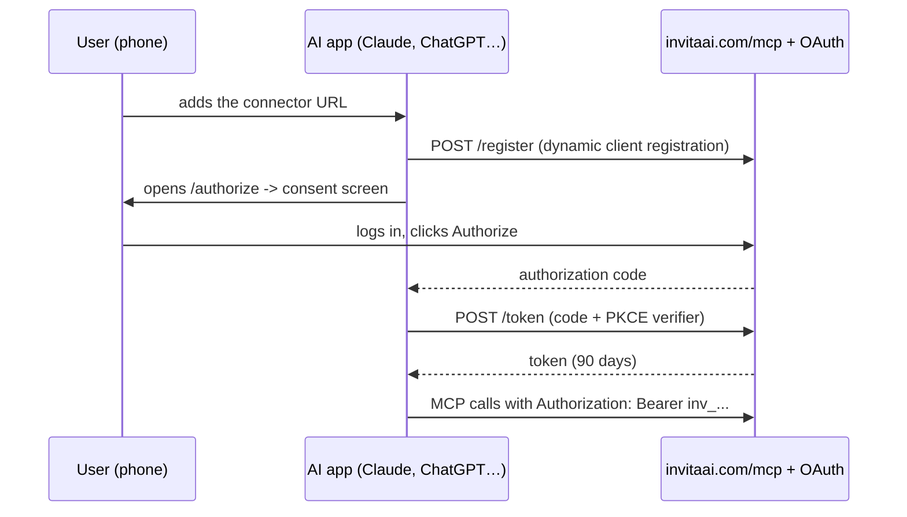
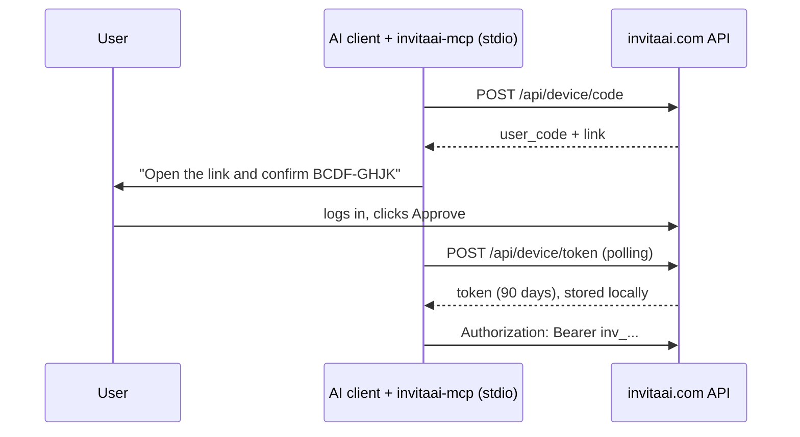

# invitaai-mcp

MCP server for [InvitaAI](https://invitaai.com), a digital invitations platform. Create events, invitations and
personalized guest links, and follow RSVPs from a phone, Claude Code, or any MCP client.

> "Create a wedding invitation for Dec 12 at Hacienda Los Arcos, champagne theme, and add my aunt Rosa with 2 seats."

## Two ways to run the same tools

| | Remote (default) | Local |
|---|---|---|
| Where it runs | Mounted at `https://invitaai.com/mcp` | On your machine, over stdio |
| Who connects | Any AI app, phone included: add the URL as a custom connector | Claude Code / Codex on that machine |
| Login | OAuth 2.1: dynamic client registration + authorization code with PKCE | Device Authorization Grant (RFC 8628): a code you approve in the browser |
| Token | Issued by the OAuth flow, sent on every request | Stored in `~/.invitaai/credentials.json` (`0600`) |

Both paths end with the same 90-day `inv_` token and the same tools. The server holds **no database
credentials** either way: it acts as the user through the same public API as the web app, so ownership
checks and business rules stay server-side.

### Remote: connecting from a phone



### Local: connecting a CLI on your own machine



## Security model

| Decision | Why |
|---|---|
| Remote login with OAuth 2.1: registration is dynamic (RFC 7591), the code is single-use and bound by PKCE | An app we've never seen can ask for access, but only a human in the browser grants it, and a stolen code is useless without the verifier. |
| Local login with the Device Authorization Grant (RFC 8628) | Same idea without a redirect: the user approves a short code in the browser; no password ever reaches the agent. |
| No refresh tokens | After 90 days the user approves again — renewal always passes through a person. |
| Tokens are random, stored server-side only as SHA-256, expire in 90 days, revocable at `/agentes` | A leaked database doesn't leak usable tokens; access is time-boxed and can be cut. |
| A token can't create or list tokens | A stolen token can't make itself permanent. Renewal always needs a human. |
| Warning from 14 days before expiry | Every tool result carries an `aviso` the agent relays to the user. |
| `device_code` and token never returned to the model | Tool outputs contain links and codes for the user, never secrets. |
| Local token file created with `0600`; remotely the token only lives in the request | Nothing readable is left behind on either path. |
| No destructive tools (delete event/guest) and no local file access | Limits damage from prompt injection. |
| Guest RSVP messages returned as `mensaje_del_invitado` and flagged in the instructions | Third-party text is data, not instructions. |
| Event type and theme are enums in the tool schema | Invalid values are rejected before reaching the API. |

## Tools

| Tool | Type |
|---|---|
| `conectar_cuenta`, `completar_conexion` | Connect or renew access (local mode only) |
| `estado_conexion` | Read |
| `listar_eventos`, `ver_evento` | Read |
| `crear_evento`, `editar_evento` | Write |
| `ver_invitacion` | Read |
| `crear_invitacion`, `editar_invitacion`, `activar_invitacion` | Write |
| `buscar_fotos` | Read |
| `crear_link_para_subir_fotos` | Write |
| `cambiar_foto_portada`, `agregar_fotos_galeria`, `poner_musica` | Write |
| `agregar_invitado`, `listar_invitados` | Write / Read |
| `ver_confirmaciones` | Read |

Prompt: `crear_invitacion_guiada` walks the user through event data, theme, photos, texts and
guests one question at a time (a slash command in clients that support prompts).

### Design notes

- **Edits merge, never replace.** The API stores invitation texts and design as whole objects,
  so every edit tool reads the current one and writes back only the requested change. Changing
  the music can't wipe the gallery.
- **Creating a second invitation for an event is refused**, pointing the model at `editar_invitacion`.
  Without that, an agent asked to "change the colour" creates a duplicate and the shared link goes stale.
- **The client model writes the invitation texts.** The platform's templates fill the rest, so no
  section is ever left blank and no extra LLM bill is added.
- **Only public https image links** reach the invitation (`javascript:`, `http:` and non-images are rejected).
- **The user's own photos travel by link, not through the model.** Tools can't receive files, so
  `crear_link_para_subir_fotos` returns a short-lived, single-invitation upload link the user opens
  on their phone. Errors about image URLs point the model at that tool instead of dead-ending.

## Use it

**Remote (phone or desktop, nothing to install):** add `https://invitaai.com/mcp` as a custom connector in your
AI app — no client ID or secret, the server registers the app itself — and approve the consent screen.
Instructions per app live at [invitaai.com/agentes](https://invitaai.com/agentes).

**Local (stdio):**

```bash
git clone https://github.com/David-Solano/invitaai-mcp && cd invitaai-mcp
python -m venv .venv && .venv/bin/pip install -e .     # Windows: .venv\Scripts\pip
claude mcp add invitaai -- /absolute/path/to/.venv/bin/invitaai-mcp
```

Then ask your agent: *"conéctame a InvitaAI"*. `INVITAAI_URL` points it at another deployment (e.g. local dev).

The deployment mounts this package with `build_server(client, con_login_local=False)`, which drops the two
device-login tools (OAuth already authenticated the user) and takes the token from the request instead of a file.

## Development

```bash
pip install -e ".[dev]"
pytest
```

Tests drive the server through the MCP protocol (in-memory client) against a fake of the InvitaAI API.

Built with Claude Code as a pair programmer; design decisions and review by the author.

MIT
